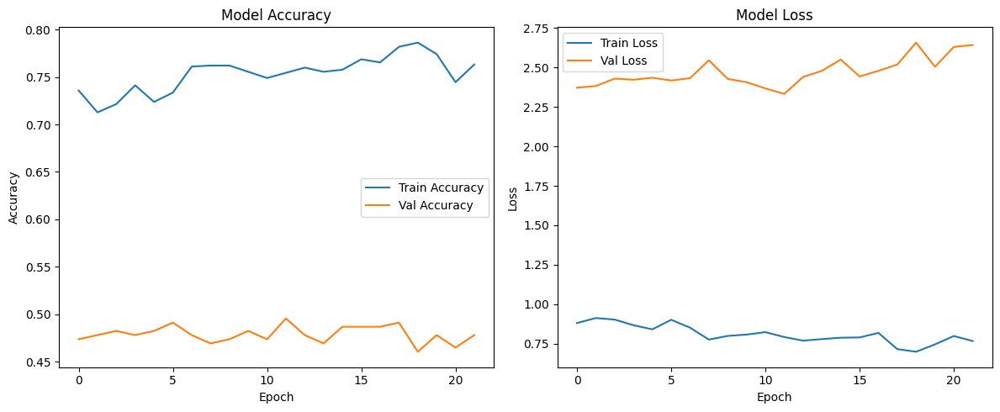
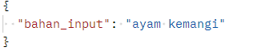
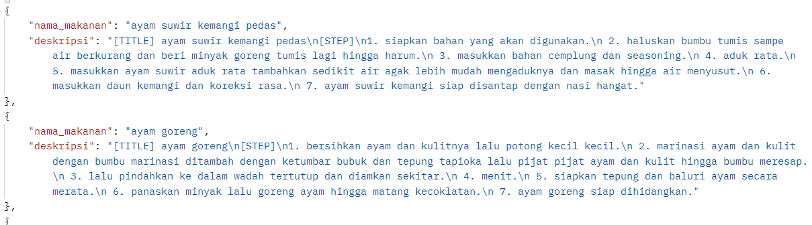

# MasaKuy: Memasak dari sisa jadi rasa

## Tim CC25 - CF036

| ID | Nama       | Learning Path              |
|----|------------------|----------------------|
| MC001D5X1234 | Sindi Aprilianti   | Machine Learning|
| MC001D5X1126 | Viby Ladyscha Yalasena Winarno| Machine Learning|
| MC001D5Y1303 | I Gusti Ngurah Sucahya Satria Adi Pratama  | Machine Learning|
| FC001D5X2367 |  Dwiamalina Qurratuain Najla | Front-end & Back-End|
| FC001D5X1428 |  Syifa Izzatul Rahmah | Front-end & Back-End|


## Latar Belakang

Indonesia termasuk salah satu negara dengan tingkat food waste tertinggi di dunia, dan salah satu penyumbang utamanya berasal dari rumah tangga. Banyak orang, termasuk mahasiswa kos sering kesulitan memanfaatkan bahan makanan sisa karena kurangnya ide resep, sehingga bahan tersebut terbuang percuma. Proyek ini bertujuan menjawab pertanyaan “Bagaimana kesesuaian antara bahan makanan sisa yang dimiliki pengguna dengan resep yang dihasilkan dapat membantu mengolah bahan tersebut guna mengurangi pemborosan?”. Untuk itu, kami mengembangkan MasaKuy, sebuah website yang merekomendasikan resep masakan berdasarkan bahan makanan sisa yang dimasukkan pengguna. Proyek ini dirancang untuk membantu pengguna, terutama mahasiswa agar dapat memanfaatkan bahan yang tersedia dengan optimal, sekaligus mengurangi pemborosan makanan. 

## Hasil
## Evaluasi Model

</br>
### Controlled Overfitting
1. Fitur pencarian resep dirancang untuk menemukan makanan spesifik yang cocok dengan kombinasi bahan yang spesifik juga. Misalnya input pengguna ``ayam, kemangi``. Maka, output yang diharapkan muncul salah satunya ``ayam suwir kemangi pedas``. </br>
**Contoh Input**</br>
</br>
**Contoh Output**</br>
<br>

2. Model tidak hanya memberikan 1 hasil, tapi beberapa resep terbaik sehingga membuat overfitting lebih aman karena hasil masih relevan.
3. Generalisasi yang terlalu tinggi membuat prediksi menjadi tidak relevan karena kombinasi bahan untuk makanan tertentu sudah sangat spesifik. 

## API Docs
### Endpoint: ``/predict``

### Request Body:
```
{
  "bahan_input": "string"
}
```
### Responses
> | http code     | content-type                      | response                                                            |
> |---------------|-----------------------------------|---------------------------------------------------------------------|
> | `200`         | `application/json`        | `OK`                                |
> | `422`         | `application/json`                | `{"detail":[{"loc":["string",0],"msg":"string","type":"string"}]}`                            |
                                                               

## Interface Website


